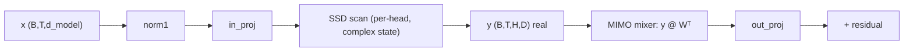

# MIMO Head Mixing: the fully-connected cross-head mixer

This doc derives why Mamba-3-Lite replaces the classical per-head SISO (single-input single-output) constraint with a dense mixer across all $H \cdot D$ scan-output channels, proves the exact index form that `nn.Linear` computes (including the transpose convention), and walks through the identity initialization and the `_identity_init` guard that keeps it alive inside `models/transformer.py:Mamba3Transformer._init_weights`.

## 1. 60-second summary

After reading this doc you will understand: what the SISO constraint is and why it limits cross-head information flow in a state-space model; why one fully-connected map applied to the per-head scan output — the same weights at every position — gives the block the cross-head mixing role that a transformer's attention stage plays, at zero sequence-dependent cost; the exact index form of the mixer (the `W^T` in `nn.Linear` is load-bearing: source channels index *rows* of `W`, destination channels index *columns*); why the mixer starts at the identity — a well-conditioned warm start under which the block behaves exactly like a plain SSM block and gradients flow through unchanged — and how the `_identity_init` attribute on the mixer's `Linear` survives the recursive `self.apply(self._init_weights)` in `models/transformer.py:Mamba3Transformer`; and the three tests in `tests/test_mimo.py` that pin all of this down.

## 2. Why it exists: the SISO constraint

Classical SSMs — S4, S6/Mamba, Mamba-2 — are **single-input single-output per channel**. In the diagonal-recurrence form of [01-ssm-foundations](01-ssm-foundations.md), the state of head $h$ evolves as

$$h^h_t = \bar a^h_t \odot h^h_{t-1} + B^h_t \otimes x^h_t, \qquad y^h_t = \sum_{n=1}^{N} C^h_{t,n} \odot h^h_{t,n},$$

where every quantity on the right-hand side carries the *same* head index $h$: the token content $x^h_t$ (that head's slice of the input projection), the input/output projections $B^h_t, C^h_t$, and the per-head decay $\bar a^h_t$. Nothing in the recurrence couples head $h$ to head $h' \neq h$. In the SSD matrix view of [02-state-space-duality](02-state-space-duality.md), each head's output is a causal, position-wise filtered version of *only its own* input channel:

$$y^h = \big(L^h \odot (C^h B^h)\big)\, x^h,$$

with $L^h$ the head-specific decay matrix. This per-head independence is not an accident — it is what makes the recurrence associative and therefore parallelizable ([01-ssm-foundations](01-ssm-foundations.md), [04-chunkwise-algorithm](04-chunkwise-algorithm.md)). But it is also a *restriction*: within the sequence-mixing stage, head $h$ can never see what head $h'$ has stored. If a computation would benefit from, say, head 3's long-range memory modulating head 11's readout, there is no direct path for it inside the scan.

Cross-head information flow is not absent from the model — it is just confined to the two position-wise dense maps that bookend the scan. `models/mamba_block.py:Mamba3Block.in_proj` mixes `d_model` into all per-head channels (a full $d_{\text{model}} \to H(D + 4N + 1)$ map, see [06-block-anatomy](06-block-anatomy.md)), and `models/mamba_block.py:Mamba3Block.out_proj` re-mixes the per-head readout into `d_model`. So heads already exchange information *around* the scan; what they cannot do is exchange it *inside* the sequence-mixing stage, at the level of the scan's own output. The MIMO mixer is the explicit answer: a fully-connected map applied to the scan output, at every position, giving the block a cross-head stage of its own. README.md describes it as replacing the classical SISO constraint with "cross-head communication for free".

## 3. Intuition first

Think of the $H$ heads as $H$ specialists, each maintaining its own private memory tape. In a transformer, the attention stage lets the *positions* talk to each other; the head outputs are then recombined by the output projection, so each specialist's contribution reaches every other specialist through the model's width. In a Mamba block, the scan is the "positions talk to each other" stage — but the head outputs never mix until the readout projection. The MIMO mixer is a dedicated meeting room inserted right after the scan: a single dense map in which every one of the $H \cdot D$ output channels is a learned weighted sum of *all* $H \cdot D$ scan-output channels, at each position.

The key architectural choice is that the mixer is **position-independent**: the same matrix $W$ is applied at every timestep. That makes it cheap in a way attention is not. Attention's per-token cost grows with how many past tokens you attend to ($O(T)$ per query — you must read every key); the mixer's per-token cost is a fixed constant regardless of context length, because it never looks at another position. It buys the transformer-style "heads share information" behavior without the transformer-style $O(T^2)$ price tag: one dense GEMM per token, no sequence dependence at all.

Why start at the identity? A random dense matrix over 1024 channels would scramble the scan output arbitrarily on the very first step — the model would have to *unlearn* a random rotation before it could learn anything useful, and the block would no longer look like a well-behaved SSM block at initialization. The identity is the unique choice that makes "mixer = no-op": at step 0 the block is *exactly* a plain SSM block (scan → readout → residual), so training starts from the known-good SISO regime, and the mixer's gradients — which at the identity pass through unchanged — decide how much cross-head mixing is actually useful.

## 4. Math

### 4.1 Setting and notation

Let the scan output be $y \in \mathbb{R}^{B \times T \times H \times D}$: batch $B$, sequence length $T$, heads $H$, head dimension $D$. This is the *real* output of the chunkwise scan — `models/ssd_complex.py:ssd_complex_chunkwise` returns $Y_{\text{diag}} + Y_{\text{off}}$ truncated to its real part, `Y.real` (Section 4.6 of [04-chunkwise-algorithm](04-chunkwise-algorithm.md)) — so the mixer operates on real float32 activations; the complex state is internal to the recurrence and never reaches it (this is deliberate; see Pitfall 3).

Flatten the last two axes row-major: flat index $i = h \cdot D + d$, i.e. $y_{\text{flat}}[b,t,i] = y[b,t, \lfloor i/D \rfloor, i \bmod D]$. Define

$$W \in \mathbb{R}^{(H \cdot D) \times (H \cdot D)},$$

the mixer weight, and the mixed output

$$y_{\text{mixed}}[b,t] = y_{\text{flat}}[b,t]\, W^{\mathsf{T}} \in \mathbb{R}^{H \cdot D}.$$

This is *not* a choice of notation: `nn.Linear(H*D, H*D, bias=False)` stores a weight of shape `(out_features, in_features)` and computes `out = x @ weight.T`. The transpose is baked into the PyTorch API, and it fixes which index of $W$ is which.

### 4.2 The index form

Writing the matrix product out elementwise, with $i$ the output (destination) flat index and $j$ the input (source) flat index:

$$y_{\text{mixed}}[b,t,i] = \sum_{j=0}^{H\cdot D - 1} y_{\text{flat}}[b,t,j] \; (W^{\mathsf{T}})_{i,j} = \sum_{j=0}^{H\cdot D - 1} y_{\text{flat}}[b,t,j] \; W_{j,i}.$$

Unflattening with $i = h \cdot D + d$ and $j = h' \cdot D + d'$:

$$\boxed{\; y_{\text{mixed}}[b,t,h,d] \;=\; \sum_{h'=0}^{H-1} \sum_{d'=0}^{D-1} W\big[h' \cdot D + d',\; h \cdot D + d\big] \; y[b,t,h',d']. \;}$$

The index convention matters. Because of the $W^{\mathsf{T}}$, the **source** head $(h', d')$ indexes the *row* of $W$ and the **destination** head $(h, d)$ indexes the *column*. A naive implementation written as $y_{\text{mixed}} = W\, y$ would transpose the roles (source = column, destination = row). Both are "fully connected", so the mistake is invisible in a shape check — but it changes which trained entries of $W$ mean what, and any code that reads `W` by hand (diagnostics, pruning, initialization studies) must use the row-source/column-destination convention above. Note also that the map is *shared across positions and batch*: $W$ carries no $t$ or $b$ index, so every position undergoes the identical linear transformation.

### 4.3 The identity warm start

At initialization $W = I$ (the $(H\cdot D)\times(H\cdot D)$ identity), so $W_{j,i} = \delta_{j,i}$ and the boxed form collapses:

$$y_{\text{mixed}}[b,t,h,d] = \sum_{h',d'} \delta_{(h',d'),(h,d)}\, y[b,t,h',d'] = y[b,t,h,d].$$

The mixer is the identity map, and the block's output at step 0 is

$$x \;\mapsto\; x \;+\; \text{out\_proj}\big(\text{scan}(x)\big),$$

i.e. *exactly* the block without the mixer — a plain SSM residual path. Three properties follow, all derivable:

1. **Well-conditioned map.** The identity has every singular value equal to 1 and condition number $\kappa = 1$. Contrast a random square Gaussian matrix with entries $\mathcal{N}(0, \sigma^2)$, $\sigma = \texttt{init\_std} = 0.02$: by the Marchenko–Pastur law its extreme singular values concentrate near $\sigma_{\max} \approx 2\sigma\sqrt{HD} \approx 1.28$ and $\sigma_{\min} \approx \sigma/(2\sqrt{HD}) \approx 3\times 10^{-4}$, so $\kappa \approx 4\times 10^{3}$ — a nearly rank-deficient scrambling of all 1024 channels. A random init would both rotate the signal arbitrarily and nearly destroy one channel's worth of information on step 1; the identity does neither.
2. **Unobstructed gradient flow.** Since $y_{\text{mixed}} = y_{\text{flat}} W^{\mathsf{T}}$, the chain rule gives $\partial L/\partial y_{\text{flat}} = (\partial L/\partial y_{\text{mixed}})\, W$. At $W = I$ the upstream gradient passes through *unchanged*: the mixer neither amplifies nor damps the gradient of the scan output. (For comparison, a random $W$ with $\sigma_{\max} \approx 1.28$ already multiplies the gradient norm by up to 1.28 and, worse, by as little as $\sigma_{\min}$ along the worst direction.)
3. **Principled prior.** "No mixing" is the neutral hypothesis; the gradient decides how much mixing helps. At step 0 the mixer's own gradient is $\partial L/\partial W = \sum_{b,t} (\partial L/\partial y_{\text{mixed}}[b,t])^{\mathsf{T}}\, y_{\text{flat}}[b,t]$ — the sum over positions of outer products of upstream gradients with scan outputs — generically nonzero, so the identity is perturbed on the very first optimizer step. The identity is a *warm start*, not a constraint (Pitfall 1).

### 4.4 Cost: one GEMM per token, no sequence dependence

The mixer is a single dense GEMM. After flattening, the forward is

$$\underbrace{(B\cdot T) \times (H\cdot D)}_{y_{\text{flat}}} \;\cdot\; \underbrace{(H\cdot D) \times (H\cdot D)}_{W^{\mathsf{T}}} \;=\; (B\cdot T) \times (H\cdot D),$$

i.e. $B \cdot T$ rows, each multiplied by the same $(HD)\times(HD)$ matrix: $B\cdot T\cdot(HD)^2$ multiply–accumulates, about $2\,B\,T\,(HD)^2$ FLOPs. **Per token** the cost is $2(HD)^2$ FLOPs — a constant independent of $T$. With the repo's $H{=}16$, $D{=}64$ ($HD = 1024$): $\approx 2.1 \times 10^6$ FLOPs per token, $\approx 4.3 \times 10^9$ per layer at $T = 2048$. The matrix $W$ itself contributes $(HD)^2 = 1{,}048{,}576$ parameters per layer — $1.05$M of the $13{,}649{,}936$ per layer ($\approx 7.7\%$), a figure that feeds the per-layer breakdown in [08-scaling-efficiency](08-scaling-efficiency.md).

The sequence independence is structural: $W$ carries no position index, so the same $B\cdot T$ GEMM works for any $T$, and there is no per-position state, no causal mask, and no $T \times T$ intermediate (contrast attention, Section 6). The FLOP count scales *linearly* in $T$; only the batch–time axis of the GEMM grows.

## 5. Code walkthrough

### 5.1 `models/mimo.py:MIMO` — construction and identity init

The entire module is one `nn.Linear` wrapped in a reshape dance:

```python
class MIMO(nn.Module):
    """MIMO mixing layer across heads."""

    def __init__(self, n_heads: int, head_dim: int):
        super().__init__()
        self.n_heads = n_heads
        self.head_dim = head_dim
        self.mix = nn.Linear(n_heads * head_dim, n_heads * head_dim, bias=False)
        nn.init.eye_(self.mix.weight)
        # Mamba3Transformer._init_weights skips Linears flagged this way.
        self.mix._identity_init = True
```

Two things happen after the `Linear` is created: `nn.init.eye_(self.mix.weight)` fills the `(HD, HD)` weight in place with the identity, and then a plain Python attribute `_identity_init = True` is set **on the `Linear` module** (`self.mix`, not on `MIMO`). The attribute is not a buffer: it is invisible to `state_dict`, to `.to()`, and to `nn.Module` machinery — it exists purely to be read by the init guard in the transformer.

### 5.2 The `_identity_init` mechanism, precisely

`models/transformer.py:Mamba3Transformer.__init__` ends with `self.apply(self._init_weights)`. `nn.Module.apply` visits the model depth-first and calls `_init_weights` on *every* submodule — embeddings, norms, every Linear, and the containers themselves. The guard is the very first line:

```python
def _init_weights(self, module):
    if getattr(module, "_identity_init", False):
        return
    if isinstance(module, nn.Linear):
        nn.init.normal_(module.weight, mean=0.0, std=self.cfg.init_std)
    elif isinstance(module, nn.Embedding):
        nn.init.normal_(module.weight, mean=0.0, std=self.cfg.init_std)
```

Walking the recursion for one block:

- `Mamba3Block` (a container): `getattr(..., "_identity_init", False)` → `False`; not a `Linear`, not an `Embedding` → no-op.
- `MIMO` (a container): same — no flag, no branch → no-op.
- `MIMO.mix` (an `nn.Linear`): `getattr(self.mix, "_identity_init", False)` → **`True`** → `return` *before* the `isinstance` check. The eye survives.
- `in_proj`, `out_proj`, `ffn_gate_up`, `ffn_down`, `lm_head` (all `nn.Linear`, no flag) → `nn.init.normal_(..., std=0.02)`, the standard init.
- `embed` (`nn.Embedding`) → `nn.init.normal_(..., std=0.02)`; the RMSNorms are neither `Linear` nor `Embedding` → untouched.

Three details make this exact mechanism work, and all three are load-bearing:

1. **The guard precedes the `isinstance` check.** If a future rewrite of `_init_weights` inits `Linear`s first and consults `_identity_init` afterwards — or iterates `module.parameters()` — the eye would be silently overwritten. The `getattr(module, "_identity_init", False)` early-return is the only thing protecting the mixer. `tests/test_mimo.py::test_mimo_identity_survives_transformer_init` exists precisely to catch such a regression.
2. **Construction order.** `MIMO` is built inside `models/mamba_block.py:Mamba3Block.__init__` (`self.mimo = MIMO(self.n_heads, self.head_dim)`), the blocks are built into `self.layers` inside `Mamba3Transformer.__init__`, and *only then* does `self.apply(self._init_weights)` run at the end of the constructor. So the flag is always present when `apply` reaches the `mix` Linear. Reverse the order — construct `MIMO` after `apply` — and the eye would be clobbered by `N(0, 0.02)`.
3. **The flag is re-established per construction.** It is not serialized with checkpoints (not a buffer), but that is fine: `MIMO.__init__` sets it fresh every time a model is built, so a checkpoint-loaded model gets the same protection as a fresh one.

### 5.3 `models/mimo.py:MIMO.forward` — the reshape dance

```python
def forward(self, x: torch.Tensor) -> torch.Tensor:
    """(B, T, H, D) -> (B, T, H, D)."""
    B, T, H, D = x.shape
    x_flat = x.reshape(B, T, H * D)
    out = self.mix(x_flat)
    return out.reshape(B, T, H, D)
```

Three steps, exactly the math of Section 4:

1. `x.reshape(B, T, H * D)` flattens the head and head-dim axes row-major — flat index $i = h\cdot D + d$, the convention Section 4.1 assumes. Note the input arrives as `Y.reshape(B_, T_padded, H, D)[:, :T, :, :]` from `models/ssd_complex.py:ssd_complex_chunkwise` — a *truncated slice* of the padded scan output, which is non-contiguous (the stride of the time axis still reflects `T_padded`), so this `reshape` may materialize a contiguous copy. The traffic is $O(BTHD)$ bytes against $O(BT(HD)^2)$ compute — a factor-of-$HD$ overhead, negligible next to the GEMM.
2. `self.mix(x_flat)` applies the $(HD)\times(HD)$ `Linear`: `x_flat @ W^T`, a single batched GEMM over the $B\cdot T$ rows — the cost analysis of Section 4.4, verbatim.
3. `out.reshape(B, T, H, D)` restores the per-head layout. The GEMM output is contiguous, so this is a view.

The method destructures exactly four dimensions and asserts nothing — the `(B, T, H, D)` contract is by convention (Pitfall 4).

### 5.4 Placement: after the scan, before `out_proj`

In `models/mamba_block.py:Mamba3Block._forward_impl`, the mixer sits between the SSD scan and the readout projection:

```python
        y = self._ssd_with_dispatch(x_ssm, B_t, C_t, dt)

        y = self.mimo(y)
        y = y.reshape(B, T, H * D)
        y = self.out_proj(y)
        x = residual + y
```

Why exactly here:

- **After the scan.** The per-head structure must still be explicit. The scan's input `x_ssm` is the per-head token content, but mixing *inputs* would change what each head writes into its own state — it would alter the SISO recurrence itself and break the clean separation "scan = per-head dynamics, mixer = cross-head readout" that keeps the scan associative and parallelizable ([04-chunkwise-algorithm](04-chunkwise-algorithm.md)). Mixing *outputs* leaves the state dynamics untouched; heads exchange information only at the readout, one position at a time. The state space stays per-head (SISO), the layer as a whole becomes MIMO.
- **Before `out_proj`.** `out_proj` is `nn.Linear(n_heads * head_dim, d_model, bias=False)` — with $d_{\text{model}} = H \cdot D = 1024$ it is a dense $1024 \times 1024$ map, and after it the head axes no longer exist. A mixer placed after `out_proj` would be a second dense map on the same vector space — algebraically redundant, since two consecutive dense maps compose into one. Placing the mixer *before* `out_proj` gives the per-head readout its own dedicated mixing matrix, and keeps `out_proj` as the "aggregate heads into model space" map.
- **The double flatten.** `MIMO.forward` returns `(B, T, H, D)`, and the block flattens again (`y.reshape(B, T, H * D)`) before `out_proj`. A slightly redundant round trip — `MIMO`'s contract is the 4-D shape, `out_proj`'s is the 2-D one — but harmless: both reshapes are views on the GEMM output, and the code reads clearly.



## 6. Why no sequence cost: the attention contrast

Attention's quadratic cost is the baseline to beat. Standard multi-head attention with $H$ heads of dimension $D$ performs, per head, two $T \times T$ matmuls ($QK^{\mathsf{T}}$ and the value contraction): $2 T^2 D$ multiply–accumulates per head, $2 H T^2 D = 2 T^2 (HD)$ across heads — plus the softmax, and $O(H T^2)$ memory for the score matrix unless a flash variant is used. The mixer, from Section 4.4, costs $T (HD)^2$ MACs. The ratio is

$$\frac{\text{attention MACs}}{\text{mixer MACs}} \;=\; \frac{2 H T^2 D}{2 T (HD)^2} \;=\; \frac{T}{H\cdot D} \;=\; \frac{T}{1024}.$$

Two facts fall out. First, the mixer's per-token cost is *constant* in $T$ ($2(HD)^2$ FLOPs, Section 4.4), while attention's per-token cost grows as $O(T\cdot HD)$ — every new token forces every query to re-read all keys. Second, at the repo's $T = 2048$ the ratio is $2$: the *entire* mixer — a full dense $1024 \times 1024$ GEMM per token — costs half of what one layer's attention stage alone would cost, and the gap widens linearly with context: $4\times$ at $T = 4096$, $8\times$ at $T = 8192$. [INFERENCE] no benchmark exists in this tree (no `.benchmarks/`), so these are FLOP-count derivations, not measured times — but the FLOP counts are exact and the scaling law ($O(T)$ vs $O(T^2)$) is structural, not empirical.

What the mixer gives up compared with attention: it is a *static* map — the same $W$ at every position, learned once — whereas attention's mixing weights are input-dependent ($q_t \cdot k_s$ varies with both positions). The mixer trades dynamic, content-based routing for a fixed, cheap linear route across heads. In the Mamba-3 design this is the accepted bargain: content-based *position* mixing already lives in the scan (via input-dependent $B, C, dt$, [03-complex-ssd](03-complex-ssd.md)); the mixer adds the *cross-head* axis that attention provides for free, without duplicating its cost profile.

## 7. Pitfalls

1. **The eye is a step-0 warm start, not a constraint.** One optimizer step perturbs every entry of $W$ (its gradient, Section 4.3, is generically nonzero), and after a few steps $y_{\text{mixed}} \neq y$. Identity-related assertions (`allclose(y, x)`) are only valid on a freshly constructed, untouched module — `tests/test_mimo.py::test_mimo_identity_init` is precisely such a check and must not be read as an invariant of training.
2. **The `_identity_init` guard is the only thing protecting the eye.** It is a plain attribute on `MIMO.mix`, checked by `getattr(module, "_identity_init", False)` *before* the `isinstance(module, nn.Linear)` branch in `models/transformer.py:Mamba3Transformer._init_weights`. Any future rewrite of `_init_weights` (or any new init pass that iterates `parameters()` or `named_modules()` and re-inits Linears) must keep honoring the flag first, or the mixer silently loses its identity init while every other Linear keeps its `N(0, 0.02)` — a subtle, checkpoint-invisible regression that only `test_mimo_identity_survives_transformer_init` catches. Also note the flag is not serialized: it is re-established in `MIMO.__init__`, so a model loaded from a checkpoint relies on its constructor having run.
3. **The mixer sees only `Y.real` — no complex mixing.** `models/ssd_complex.py:ssd_complex_chunkwise` returns `Y_diag + Y_off` truncated to its real part, so `MIMO` receives float32 real activations and `W` is real. The complex state is an internal representation of the recurrence ([03-complex-ssd](03-complex-ssd.md)); the model observes only its real projection, and the mixer mixes what the model observes. Mixing the complex output instead would double the width (and cost), require a complex $W$, and — because `.real` discards the imaginary part before the residual add — would train the imaginary half of $W$ against zero gradient.
4. **The `(B, T, H, D)` contract is by convention, not enforced.** `MIMO.forward` destructures `x.shape` into exactly four values and asserts nothing. A caller passing the already-flattened `(B, T, H*D)` gets `H = 1, D = HD` and a *silent* wrong output shape `(B, T, 1, HD)` — no error. The block always feeds the 4-D scan output, so the model is safe, but any direct use of `MIMO` must respect the 4-D layout.
5. **Ordering of construction vs `apply`.** The flag only works because `MIMO` is constructed (inside `Mamba3Block.__init__`) before `Mamba3Transformer.__init__` calls `self.apply(self._init_weights)`. A refactor that constructs the mixer after the init pass — or re-runs `apply` after re-creating `mix` — would overwrite the eye. The current order, and the early-return guard, are a matched pair.

## 8. Tests

- `tests/test_mimo.py::test_mimo_identity_init` — builds `MIMO(n_heads=4, head_dim=32)`, `eval()`, passes `randn(2, 8, 4, 32)` through it, and asserts the output shape is `(2, 8, 4, 32)` and `torch.allclose(y, x, atol=1e-6)`. This is the machine proof of Section 4.3: at initialization the mixer is the identity map, so the forward reduces to a reshape round trip.
- `tests/test_mimo.py::test_mimo_identity_survives_transformer_init` — builds a full `Mamba3Transformer` with a tiny config (`d_model=32, n_heads=4, head_dim=16, n_layers=1`), then asserts `torch.equal(m.layers[0].mimo.mix.weight, torch.eye(4 * 16))`. This is the end-to-end proof of Section 5.2: the recursive `self.apply(self._init_weights)` ran over the whole model and the `_identity_init` guard held. It fails if the guard is removed or reordered.
- `tests/test_mimo.py::test_mimo_shape_and_finite` — train-mode forward with `torch.manual_seed(0)`: asserts output shape `(2, 8, 4, 32)` and `torch.isfinite(y).all()` — a smoke check that the mixer path (and the GEMM) behaves in training mode; it is not an identity check.

All three run on CPU and are part of the 28 passing tests on a CPU box (the 5 GPU-gated tests are the Triton/e2e paths). For the API contract (signature, shapes, the flag) see [reference/06-mimo](../reference/06-mimo.md); the surrounding block wiring is in [reference/05-mamba-block](../reference/05-mamba-block.md) and [reference/04-transformer](../reference/04-transformer.md); the init scheme as a whole (including the `_identity_init` escape hatch) is summarized in [07-numerical-stability](07-numerical-stability.md).

## Anchors cited

- `models/mimo.py:MIMO`
- `models/mimo.py:MIMO.forward`
- `models/mamba_block.py:Mamba3Block._forward_impl`
- `models/transformer.py:Mamba3Transformer._init_weights`
- `models/transformer.py:Mamba3Transformer`
- `models/mamba_block.py:Mamba3Block`
- `models/ssd_complex.py:ssd_complex_chunkwise`
